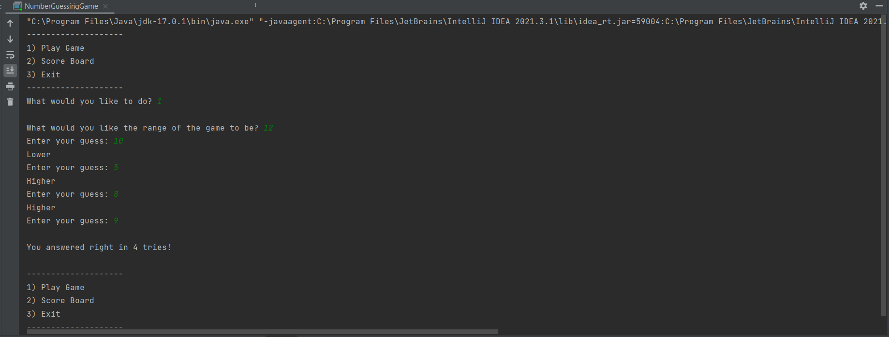
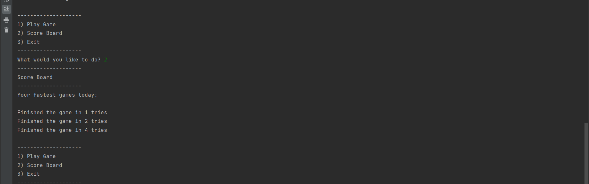
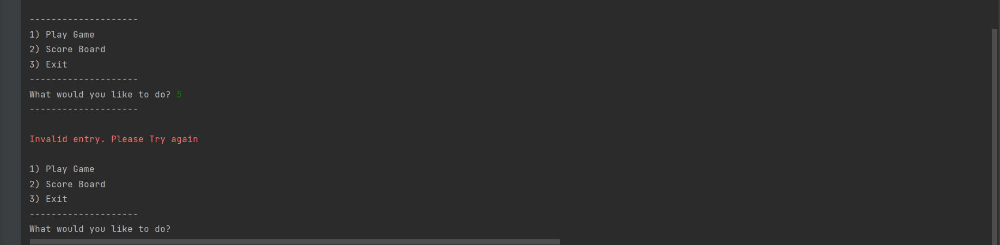
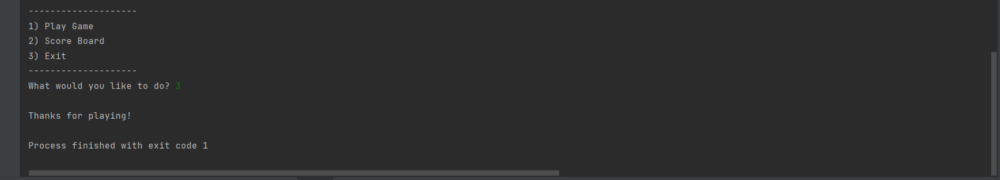

# Number-Guessing-Game

Number Guessing Game is a console-based number guessing game where the user can input the number range, and the program will generate a random number within the range. The user will then be able to guess the number with the program keeping track of how many tries they took.

## Demonstration 
### Guess

## ScoreBoard

### Error

### Exit

